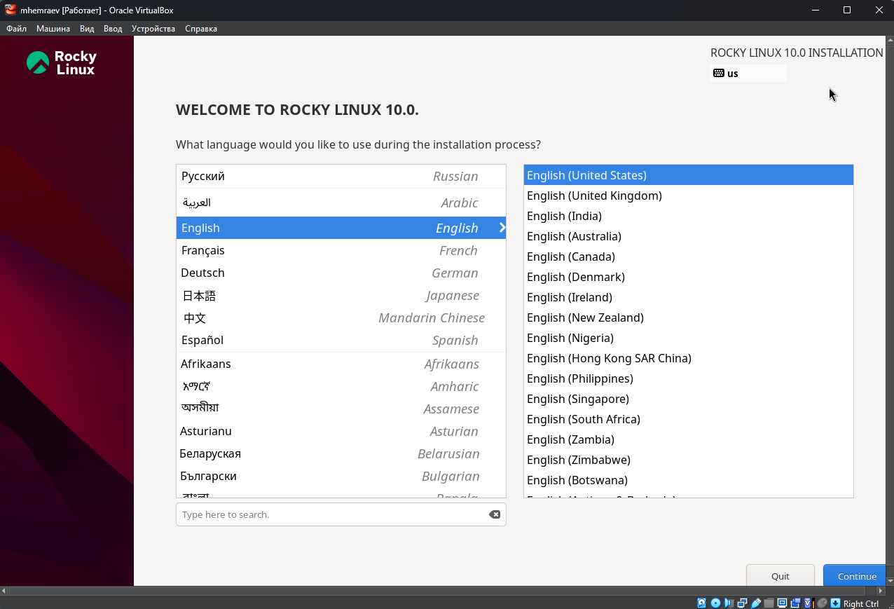
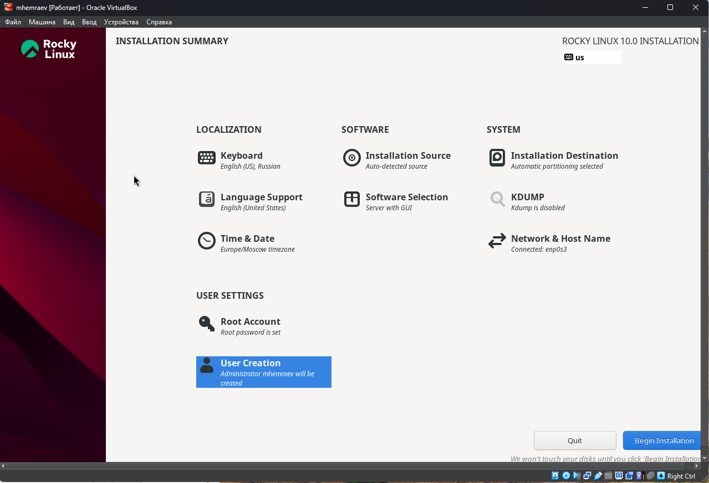
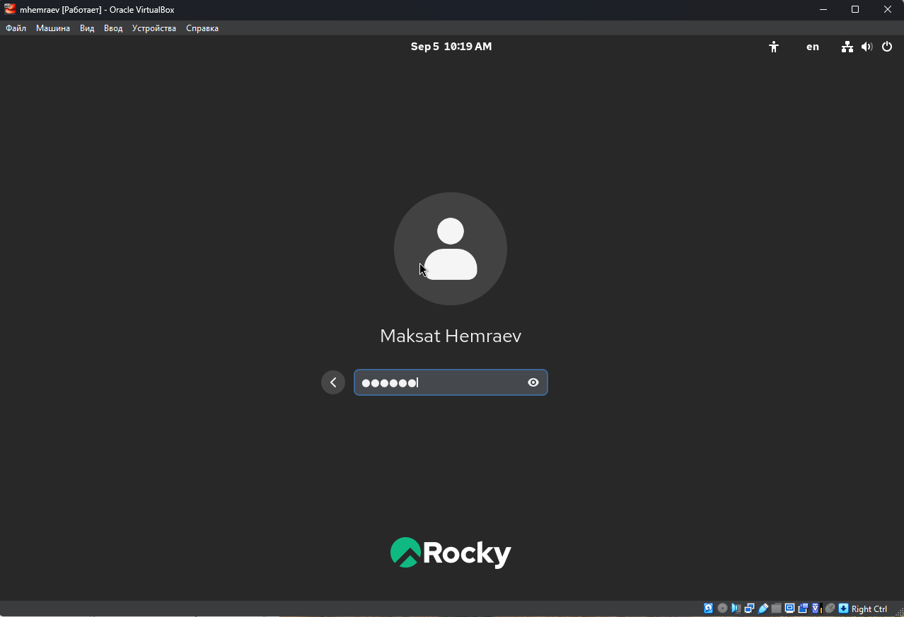
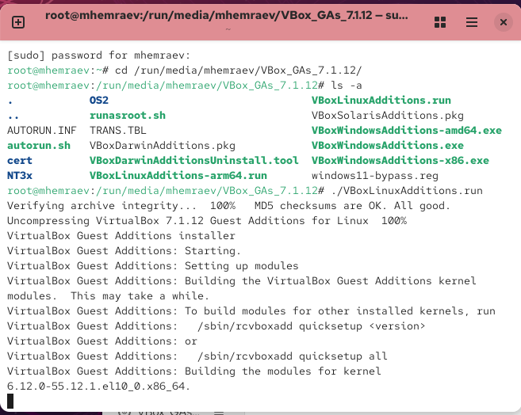
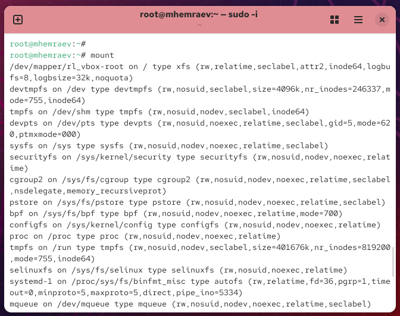

---
## Front matter
lang: ru-RU
title: Отчёт по лабораторной работе №1
subtitle: Установка Rocky Linux в VirtualBox
author:
  - Максат Хемраев
institute:
  - Российский университет дружбы народов, Москва, Россия
date: 5 сентября 2025

## i18n babel
babel-lang: russian
babel-otherlangs: english

## Formatting pdf
toc: false
slide_level: 2
aspectratio: 169
section-titles: true
theme: metropolis
header-includes:
 - \metroset{progressbar=frametitle,sectionpage=progressbar,numbering=fraction}
---

# Цель работы

## Основная цель

Установить и настроить Rocky Linux в VirtualBox, затем проверить работу системы.

# Ход выполнения

## Конфигурация ВМ в VirtualBox

{ #fig:001 width=70% }

## Выбор языка установки

{ #fig:002 width=70% }

## Сводка параметров установки

{ #fig:003 width=70% }

## Ход установки

{ #fig:004 width=70% }

## Экран входа (GDM)

{ #fig:005 width=70% }

## Установка VirtualBox Guest Additions

{ #fig:006 width=70% }

# Проверка системы

## Ядро и CPU (dmesg)

{ #fig:007 width=70% }

## Гипервизор (dmesg)

{ #fig:008 width=70% }

## Смонтированные файловые системы (mount)

{ #fig:009 width=70% }

# Итоги

## Вывод

Rocky Linux установлен и работает. Выполнена интеграция с VirtualBox (Guest Additions), вход в систему и базовая проверка: ядро, CPU, гипервизор и файловые системы отображаются корректно.
