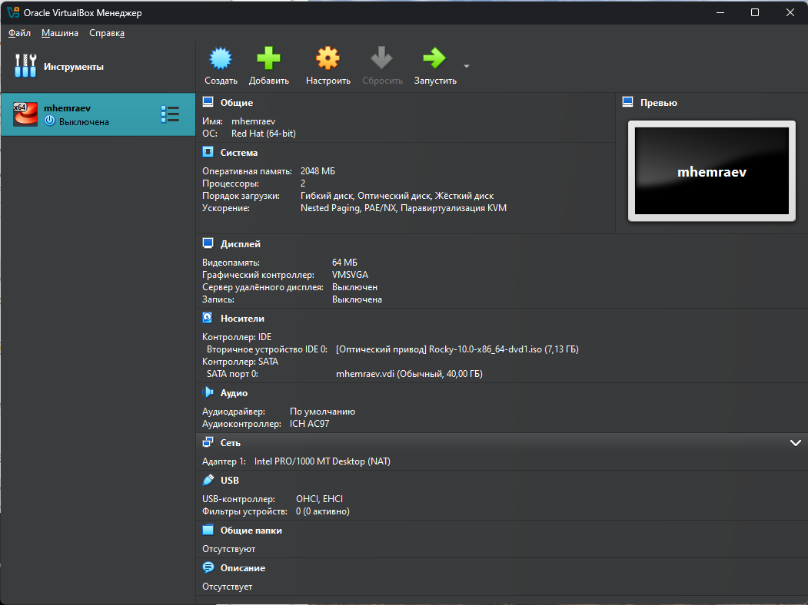
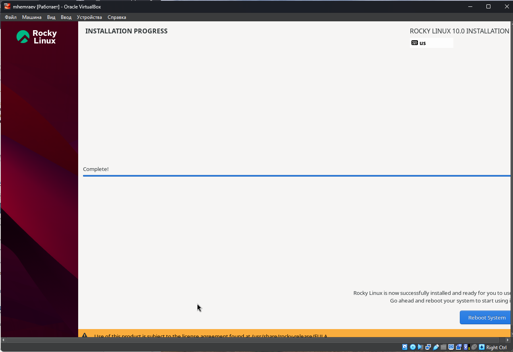
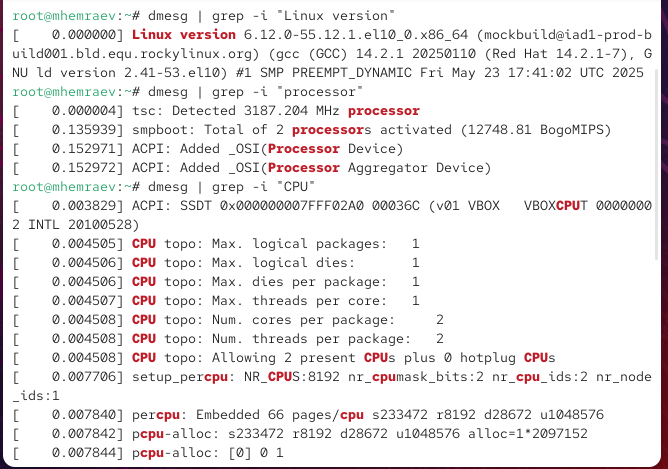
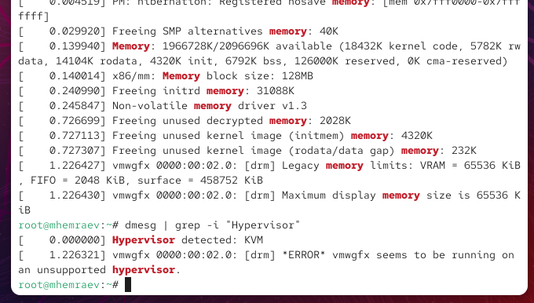

---
## Front matter
title: "Отчёт по лабораторной работе №1"
subtitle: "Установка и проверка работы Rocky Linux в VirtualBox"
author: "Максат Хемраев"

## Generic otions
lang: ru-RU
toc-title: "Содержание"

## Bibliography
bibliography: bib/cite.bib
csl: pandoc/csl/gost-r-7-0-5-2008-numeric.csl

## Pdf output format
toc: true
toc-depth: 2
lof: true
lot: true
fontsize: 12pt
linestretch: 1.5
papersize: a4
documentclass: scrreprt
## I18n polyglossia
polyglossia-lang:
  name: russian
  options:
    - spelling=modern
    - babelshorthands=true
polyglossia-otherlangs:
  name: english
## I18n babel
babel-lang: russian
babel-otherlangs: english
## Fonts
mainfont: IBM Plex Serif
romanfont: IBM Plex Serif
sansfont: IBM Plex Sans
monofont: IBM Plex Mono
mathfont: STIX Two Math
mainfontoptions: Ligatures=Common,Ligatures=TeX,Scale=0.94
romanfontoptions: Ligatures=Common,Ligatures=TeX,Scale=0.94
sansfontoptions: Ligatures=Common,Ligatures=TeX,Scale=MatchLowercase,Scale=0.94
monofontoptions: Scale=MatchLowercase,Scale=0.94,FakeStretch=0.9
mathfontoptions:
## Biblatex
biblatex: true
biblio-style: "gost-numeric"
biblatexoptions:
  - parentracker=true
  - backend=biber
  - hyperref=auto
  - language=auto
  - autolang=other*
  - citestyle=gost-numeric
## Pandoc-crossref LaTeX customization
figureTitle: "Рис."
tableTitle: "Таблица"
listingTitle: "Листинг"
lofTitle: "Список иллюстраций"
lotTitle: "Список таблиц"
lolTitle: "Листинги"
## Misc options
indent: true
header-includes:
  - \usepackage{indentfirst}
  - \usepackage{float}
  - \floatplacement{figure}{H}
---

# Цель работы

Освоить установку операционной системы Rocky Linux в среде VirtualBox, а также проверить работу системы и её компонентов.

# Ход выполнения

Сначала я создал виртуальную машину с именем *mhemraev* и назначил ресурсы (рис. \[@fig:001]).

{ #fig:001 width=70% }

После этого выбрал ISO-образ Rocky Linux и язык установки — English (рис. \[@fig:002]).

{ #fig:002 width=70% }

На следующем шаге настроил параметры установки: клавиатура, источник установки, дата и время, создание пользователя и root-аккаунта (рис. \[@fig:003]).

{ #fig:003 width=70% }

Далее началась установка системы (рис. \[@fig:004]).

{ #fig:004 width=70% }

После перезагрузки появилась форма входа, где я вошёл как *Maksat Hemraev* (рис. \[@fig:005]).

{ #fig:005 width=70% }

Чтобы улучшить интеграцию, установил VirtualBox Guest Additions (рис. \[@fig:006]).

{ #fig:006 width=70% }

Проверил версию ядра и параметры процессора (рис. \[@fig:007]).

{ #fig:007 width=70% }

Система определила гипервизор KVM (рис. \[@fig:008]).

{ #fig:008 width=70% }

Также посмотрел список смонтированных файловых систем (рис. \[@fig:009]).

{ #fig:009 width=70% }

# Контрольные вопросы

1. **Основные команды Linux**
   `ls`, `cd`, `pwd`, `mkdir`, `touch`, `rm`, `chmod`, `chown`, `man`, `history`.

2. **Учётная запись пользователя**
   Содержит имя, UID, GID, домашнюю директорию и shell. Данные: `/etc/passwd`, `/etc/shadow`, `/etc/group`.

3. **Типы файловых систем**
   Ext4 (универсальная), XFS (для больших систем), Btrfs (поддержка снапшотов), NTFS (Windows).

4. **Как узнать смонтированные разделы**
   Команды: `mount`, `df -h`, `lsblk`.

5. **Как завершить зависший процесс**
   Найти через `ps aux` или `top`, завершить с помощью `kill -9 PID`.

# Заключение

Я установил и настроил Rocky Linux в VirtualBox. Созданы root и пользователь, настроена клавиатура, добавлены Guest Additions. Система успешно работает и готова к использованию.
