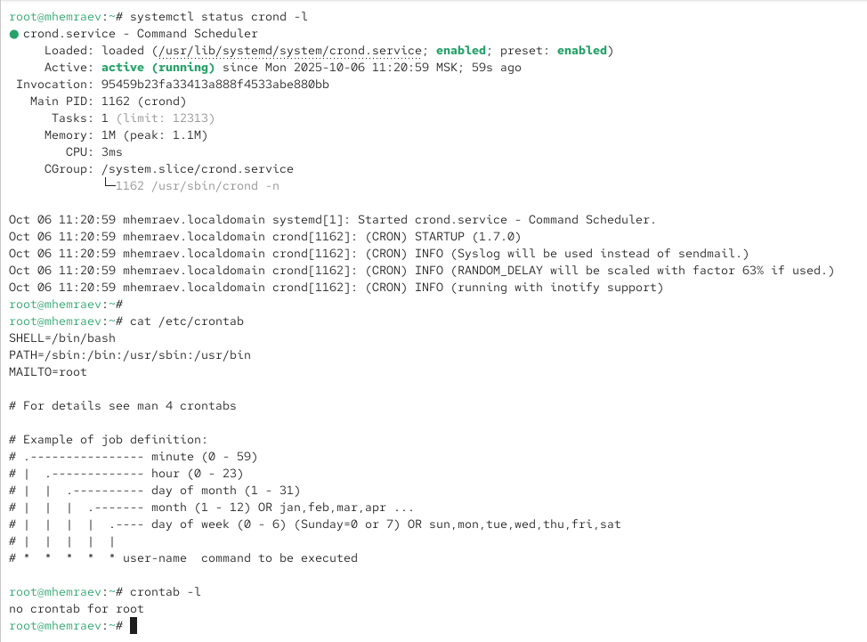

---
## Front matter
lang: ru-RU
title: Лабораторная работа №8
subtitle: Планировщики событий cron и at
author:
  - Максат Хемраев
institute:
  - Российский университет дружбы народов, Москва, Россия
date: 11 октября 2025

## i18n babel
babel-lang: russian
babel-otherlangs: english

## Formatting pdf
toc: false
toc-title: Содержание
slide_level: 2
aspectratio: 169
section-titles: true
theme: metropolis
header-includes:
 - \metroset{progressbar=frametitle,sectionpage=progressbar,numbering=fraction}
---

# Цель работы

## Основная цель

Получение навыков работы с планировщиками событий **cron** и **at** в операционных системах Linux.

# Ход выполнения работы

## Проверка службы cron

- Проверен статус службы **crond**  
- Демон активен и работает корректно

{ #fig:001 width=70% }

## Изучение файла /etc/crontab

- Просмотрен основной конфигурационный файл планировщика  
- Определён принцип периодического выполнения команд

{ #fig:002 width=70% }

## Добавление задания cron

- Открыт редактор расписания через `crontab -e`  
- Команда выполняется каждую минуту и записывает сообщение в журнал

{ #fig:003 width=70% }

## Проверка выполнения задания

- Обнаружены записи с сообщением из cron  
- Задание выполняется корректно

{ #fig:004 width=70% }

## Изменение расписания

- Команда выполняется каждый час, с понедельника по пятницу  
- Проверка показала корректное срабатывание по расписанию

{ #fig:005 width=70% }

## Создание сценария eachhour

- В каталоге /etc/cron.hourly создан файл **eachhour**
- Сделан исполняемым с помощью chmod +x

{ #fig:006 width=70% }

## Планирование через /etc/cron.d

- Создан файл **eachhour** с записью:
  11 * * * * root logger This message is written from /etc/cron.d  
- Команда выполняется каждый час в 11-й минуте

{ #fig:007 width=70% }

## Проверка службы atd

- Проверен статус службы **atd** — активна  
- Использована команда `at 11:33` для запуска задачи

{ #fig:008 width=70% }

# Итоги работы

## Вывод

В ходе лабораторной работы были освоены инструменты **cron** и **at**, обеспечивающие автоматизацию и надёжное выполнение задач в Linux по заданному расписанию.
